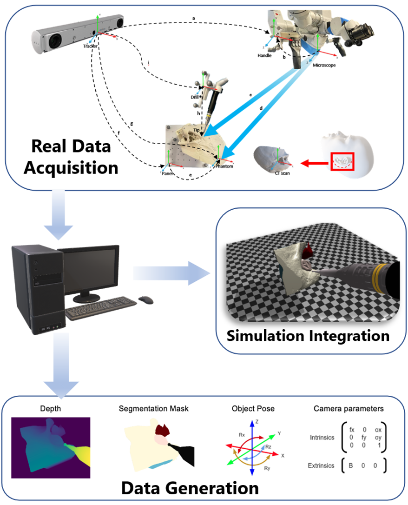

# RoboMaster

Author: Ruixing Liang (rliang7@jh.edu) Hongchao Shu (hshu4@jhu.edu)

## Introduction

This is Repo tailored for accurate Synchronization between simulation in Virtual Reality (VR) and Real world, which is tracked by optical tracker using Atracsys fusionTrack 500 and Microscope (Haag-Streit Allegra 500). This repo is initallized for Computer Integrated Surgery II in Johns Hopkins University Robotics Course will further optimized and incorporated in MICCAI submission open source repo subsequently. Please follow and star for tracking the status. This could also be seen as a pre-release of AMBF plugin for optical tracker extensions. 



##Status

For now, we implemented and evaluated:

### Registration Pipeline

1. **Pivot Calibration**, **Geometry Generation** Functions to define concisely and compactly which only need marker information which is intended to expand usage to different platforms you may have in hand.
2. **Camera Calibration** (Still Work in Progress), Early implementation using preliminary OpenCV API has been identified as one of the problem we have in progress, since we pursue the highest accuracy we could possibly get. **Stereo Camera Rectification** with evaluations has been implemented.
3. **Fixed Transformation from Known Geometry to Phantom** or in other case your object of interest has been implement based on Open3D ICP API.
4. **Hand Eye Calibration** (Still Work in Progress), Early implementations based on ETH Dual Quaternion Algorithm has been tested. Further results will be needed before our final version of update.
5. **VR Set Up**(Still Work in Progress), Implementation based on AMBF framework and Pyvista has been tested, functional and refinement will be carried out before the release of first complete version.
6. **Data Generation**(Still Work in Progress) AMBF based data generation will be introduced in final version submission. Evaluation on that would be released in related paper.

### Usage

To run our project as a whole requires you to implement many adaptations based on your current hardware API. For instance, Camera Acquisition Pipelines and Optical Tracker may be faced a large fix if we are using different platform when you are pursuing the equivalent accuracy as we have evaluated.

Except for VR part, test and evaluations have been tested on three main streams including Windows OS, Mac OS, Ubuntu 20.04, 18.04, etc. VR part explicitly has been tested on Ubuntu 16.04 and Ubuntu 18.04 and Mac Mojave without ROS support. For better usage we simply recommend you to use docker to pull our image and run your container.

**Quicker Start**

1. Download and Configure Docker

**Complete Build**

1. Create AMBF Framework and Set it up

```bash
sudo apt install libasound2-dev libgl1-mesa-dev xorg-dev
cd ~
git clone https://github.com/WPI-AIM/ambf.git
cd ambf && mkdir build
cd build
cmake ..
make
cd ..
git clone https://github.com/LCSR-SICKKIDS/volumetric_drilling
cd volumetric_drilling
mkdir build
cd build
cmake ..
make
```

2. Set up the Communication between ROS nodes in .bashrc  

  

###Citation

Please kindly wait until we have our results on our pub to cite our works. Thanks!