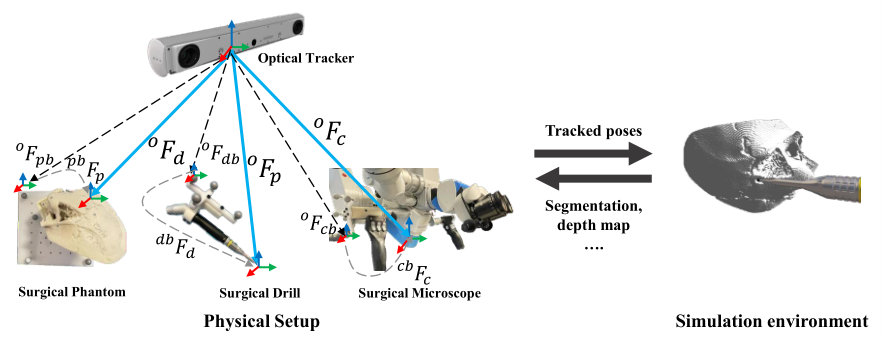

# [Twin-S: A Digital Twin Paradigm for Skull Base Surgery](https://arxiv.org/abs/2211.11863)

This is the official code for our paper accepted at IPCAI 2023 and IJCARS.


If you find our project useful, please cite
```
@article{shu2023twin,
  title={Twin-S: a digital twin for skull base surgery},
  author={Shu, Hongchao and Liang, Ruixing and Li, Zhaoshuo and Goodridge, Anna and Zhang, Xiangyu and Ding, Hao and Nagururu, Nimesh and Sahu, Manish and Creighton, Francis X and Taylor, Russell H and others},
  journal={International Journal of Computer Assisted Radiology and Surgery},
  pages={1--8},
  year={2023},
  publisher={Springer}
}
```

## Overview

We present a digital twin paradigm for skull base surgery named Twin-S. It models and tracks the critical
components of skull-base surgery, including the surgical tool, patient anatomy,
and surgical camera. Significantly, Twin-S updates patient anatomy to account
for the real-world tool to tissue interactions in real-time.


## Usage

To run our project as a whole requires you to implement many adaptations based on your current hardware API. For instance, Camera Acquisition Pipelines and Optical Tracker may be faced a large fix if we are using different platform when you are pursuing the equivalent accuracy as we have evaluated.

### Setup
1. Our system has been tested on Ubuntu 20.04 and Ubuntu 18.04.
2. We use [ROS Noetic](https://wiki.ros.org/noetic/Installation) for data synchronization and visulization.
3. Before you start, make sure [AMBF and the volmetric drilling plugin](https://github.com/Soooooda69/volumetric_drilling/tree/Twin-S) is properly built.
4. We use [Atracsys FusionTrack-500](https://atracsys.com/fusiontrack-500/) to track 6 DoF poses for each critical components.
5. We use [ZED mini](https://www.stereolabs.com/docs) to capture stereo images. Build the [ZED-ros-wrapper](https://github.com/stereolabs/zed-ros-wrapper). 


## Calibration & Registration Piplines
### Pivot Calibration

1. [Record](https://github.com/Rxliang/Twin-S/blob/linux/pipelines/recordAll.sh) the ROS bag of pivot tool's poses.

```bash
./recordAll.sh -p <$path>
```
2. Load the poses from bag, perform [pivot calibration](https://github.com/Rxliang/Twin-S/blob/linux/pipelines/pivot_calibration.sh) and save the result.

```bash
./pivot_calibration.sh -p <$path> -s <$save_name> -t <$topic>
```

### Phantom Registration
1. With a calibrated pointer tool, you can [manually sample](https://github.com/Rxliang/Twin-S/blob/linux/optical_tracking/atracsys_subscriber/atracsys_subscriber.py) hundards of points on the phantom surface. Make sure to set you own OUTPUT_PATH.
```bash
cd optical_tracking/atracsys_subscriber
python atracsys_subscriber.py
```
2. Then the [ICP registration](https://github.com/Rxliang/Twin-S/blob/linux/optical_tracking/phantom_registration_T_p_pb.py) can be used to register your 3d model to tracker's coordinate. Adjust the paths accordingly before using.
```bash
cd optical_tracking
python phantom_registration_T_p_pb.py
```

### Hand-eye Calibration
1. [Record](https://github.com/Rxliang/Twin-S/blob/linux/pipelines/recordAll.sh) the ROS bag of the left images and poses of optical markers fixed on the camera.
```bash
./recordAll.sh -h <$path>
```
2. We use ChArUco board which can be generated from [here](https://calib.io/pages/camera-calibration-pattern-generator) for camera pose estimation. Extract the camera poses directly from ros bag.
```bash
cd preparation
python camera_pose_extraction.py --bag <$bag_path> --outdir <$output_path> --l_topic <$ros_topic> --csv <$poses_output_csv>
```
3. To run the hand-eye calibration, properly build the [calibration tool](https://github.com/ethz-asl/hand_eye_calibration). Then run the following.
```bash
rosrun hand_eye_calibration compute_complete_handeye_calibration.sh <$optical_markers_poses_csv> <$camera_poses_csv>
```

## Running the Digital Twins
### Tracking
Put the [tracking geometry files](https://github.com/Rxliang/Twin-S/tree/linux/params/tracking%20geometries) in: 'catkin_ws/src/cisst-saw/sawAtracsysFusionTrack/share'. Follow the command lines then below.
```bash
cd <$your_path>/catkin_ws/src/cisst-saw/sawAtracsysFusionTrack/share
rosrun atracsys_ros atracsys_json -j <$configFile.json>
```

### Video Streaming
Start zed-ros-wrapper, make sure you can subscribe the published image topics with ROS.
```bash
roslaunch zed_wrapper zedm.launch
```

### Start Simulation
Properly follow the instructions of [AMBF and the volmetric drilling plugin](https://github.com/Soooooda69/volumetric_drilling/tree/Twin-S) and prepare your own launch and other config files.

### Data Collection
You can simply run the [bash file](https://github.com/Rxliang/Twin-S/blob/linux/pipelines/data_collection.sh). It contains few scripts: 
1. [synchronizer.py](https://github.com/Rxliang/Twin-S/blob/linux/util/synchronizer.py) automatically syncs ros topics of tracking poses and stereo images. 
2. [drill_move_imgPub.py](https://github.com/Soooooda69/volumetric_drilling/blob/Twin-S/scripts/drill_move_imgPub.py) processes and commands the drill and phantom to move in AMBF. 
3. [offline_segm_eval.py](https://github.com/Soooooda69/volumetric_drilling/blob/Twin-S/scripts/offline_segm_eval.py) generates overlay of RGB images and simulation images, then pulish to a new topic for visualization.
4. [recordAll.sh](https://github.com/Rxliang/Twin-S/blob/linux/pipelines/recordAll.sh) records poses and images, and save it to a ros bag.
```bash
./data_collection.sh -c <$config_file> -s <$save_path>
```
