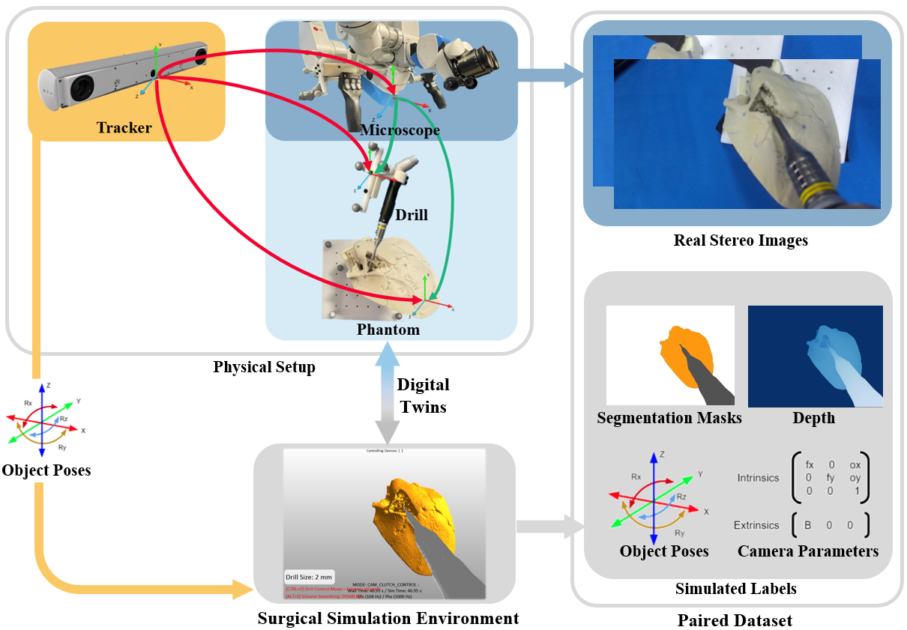

# RoboMaster

Author: Ruixing Liang (rliang7@jh.edu) Hongchao Shu (hshu4@jhu.edu)

## Introduction

We present a digital twin framework for skull base surgery named Twin-S. It models, tracks and updates all critical components of skull-base surgeries in real-time. Moreover, we can further generate plothera-paired dataset where images of the surgical scene are paired with virtually generated labels. Through this pairing, we are able to reduce the cost of dataset labeling and avoid the sim-to-real transfer issue commonly faced by synthetic data.




### Usage

To run our project as a whole requires you to implement many adaptations based on your current hardware API. For instance, Camera Acquisition Pipelines and Optical Tracker may be faced a large fix if we are using different platform when you are pursuing the equivalent accuracy as we have evaluated.

Except for VR part, test and evaluations have been tested on three main streams including Windows OS, Mac OS, Ubuntu 20.04, 18.04, etc. VR part explicitly has been tested on Ubuntu 16.04 and Ubuntu 18.04 and Mac Mojave without ROS support. For better usage we simply recommend you to use docker to pull our image and run your container.

**Quicker Start**

1. Download and Configure Docker

**Complete Build**

1. Create AMBF Framework and Set it up

```bash
sudo apt install libasound2-dev libgl1-mesa-dev xorg-dev
cd ~
git clone https://github.com/WPI-AIM/ambf.git
cd ambf && mkdir build
cd build
cmake ..
make
cd ..
git clone https://github.com/LCSR-SICKKIDS/volumetric_drilling
cd volumetric_drilling
mkdir build
cd build
cmake ..
make
```

2. Set up the Communication between ROS nodes in .bashrc  

  

### Citation

Please kindly wait until we have our results on our pub to cite our works. Thanks!
